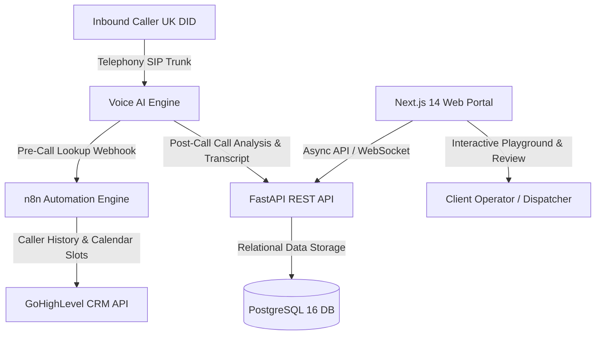

# 🎙️ Keystone Voice Agent Client Portal

An enterprise-grade, high-conversion Voice Agent Client Handover Portal tailored for trade contractors (heating, plumbing, electrical, roofing). Built with a modern **Next.js 14 App Router** frontend, a high-performance asynchronous **FastAPI** backend, and a scalable **PostgreSQL 16** database.

---

## 🏗️ System Architecture



---

## 🚀 Tech Stack

| Layer | Technology | Key Capabilities |
| :--- | :--- | :--- |
| **Frontend** | **Next.js 14 (App Router)** | TypeScript, Glassmorphism CSS, Audio Waveform Visualizer, Speech Synthesis Playground |
| **Backend** | **FastAPI (Python 3.11)** | Asynchronous REST endpoints, Pydantic v2 schemas, SQLAlchemy 2.0 ORM, auto-seed |
| **Database** | **PostgreSQL 16** | Relational tables (`calls`, `contacts`, `knowledge_bases`, `invoices`, `audit_logs`) with JSONB |
| **Integrations** | **Voice AI & GHL CRM** | Webhook intake, dual-channel audio metadata, calendar appointment verification |

---

## 📁 Repository Structure

```
.
├── docker-compose.yml           # Multi-container orchestration (Postgres, FastAPI, Next.js)
├── init_db.sql                  # PostgreSQL initialization schema DDL & trade seed data
├── PORTAL_SYSTEM_ARCHITECTURE.md# Complete end-to-end data pipeline & webhook specifications
├── QUALITY_ASSURANCE_REPORT.md  # Comprehensive 10-screen QA test matrix
│
├── frontend/                    # Next.js 14 Application
│   ├── package.json
│   ├── tsconfig.json
│   ├── next.config.js
│   └── src/
│       ├── app/                 # App Router pages (Overview, Calls, Contacts, KB, Billing, Users, Audit, Settings)
│       ├── components/          # Sidebar, Topbar, CallReviewDrawer, VoicePlaygroundModal
│       └── lib/                 # api.ts (typed client), types.ts (schema contracts)
│
├── backend/                     # FastAPI Application
│   ├── requirements.txt
│   ├── Dockerfile
│   ├── seed_data.py             # Automatic database bootstrapper
│   └── app/
│       ├── main.py              # Application entrypoint & CORS middleware
│       ├── core/config.py       # Pydantic environment configuration
│       ├── db/session.py        # SQLAlchemy PostgreSQL session with SQLite fallback
│       ├── models/models.py     # SQLAlchemy ORM entity models
│       ├── schemas/schemas.py   # Pydantic request/response validation schemas
│       └── api/v1/endpoints/   # Modular route controllers
│
├── index.html                   # Zero-dependency standalone SPA (can open directly in Chrome/Edge)
├── styles.css                   # Custom glassmorphism dark navy stylesheet
└── app.js                       # Standalone client-side reactive engine
```

---

## ⚡ Quickstart Guide

### Option 1: One-Command Docker Compose (Recommended for Full Stack)

```bash
docker compose up --build
```
- **Next.js Frontend:** [http://localhost:3000](http://localhost:3000)
- **FastAPI Swagger Docs:** [http://localhost:8000/docs](http://localhost:8000/docs)
- **PostgreSQL Database:** `localhost:5432` (`voice_agent_db`)

---

### Option 2: Local Development (Without Docker)

#### 1. Start the FastAPI Backend
```bash
cd backend
python -m venv venv
# Windows:
venv\Scripts\activate
# Mac/Linux:
# source venv/bin/activate

pip install -r requirements.txt
uvicorn app.main:app --reload --port 8000
```
> *Note: If no PostgreSQL server is running, the backend will automatically fallback to a local SQLite database (`voice_agent_portal.db`) and seed initial trade data without crashing.*

#### 2. Start the Next.js Frontend
```bash
cd frontend
npm install
npm run dev
```
Open [http://localhost:3000](http://localhost:3000) in your browser.

---

### Option 3: Zero-Install Standalone Mode
Double-click `index.html` in this folder to open the full standalone application directly in Google Chrome or Microsoft Edge. It includes all 10 views, audio players, and the live voice simulation engine without running any local servers.

---

## 📡 Core API Endpoints

| Method | Endpoint | Description |
| :--- | :--- | :--- |
| `GET` | `/api/v1/overview/metrics` | Returns total calls, captured pipeline value, ROI, and hourly heatmap |
| `GET` | `/api/v1/calls/` | Returns paginated calls with search, outcome, and sentiment filters |
| `GET` | `/api/v1/calls/{id}` | Returns single call detail with dual-channel audio and transcript |
| `PATCH` | `/api/v1/calls/{id}/feedback` | Updates human QA review status (`Accurate`, `Hallucination`, etc.) |
| `GET` | `/api/v1/contacts/` | Returns CRM synced contacts with call counts |
| `PATCH` | `/api/v1/contacts/{id}/notes` | Updates customer notes synced to GHL CRM custom fields |
| `POST` | `/api/v1/knowledge-base/search` | Tests semantic vector search against trade service catalogs |
| `POST` | `/api/v1/webhooks/voice` | Webhook intake for live Voice AI completed phone calls |
| `POST` | `/api/v1/webhooks/n8n/pre-call`| Pre-call webhook returning existing customer context to the voice agent |

---

## 🔒 Security & Compliance
- **SOC-2 & GDPR Compliance:** Immutable audit logs track every configuration modification, KB upload, and human QA rating in `audit_logs`.
- **RBAC:** Four discrete permission roles (`Owner`, `Manager`, `Operator`, `Billing`).
- **Data Retention:** Voice recordings are securely referenced via signed S3/R2 presigned URLs.
